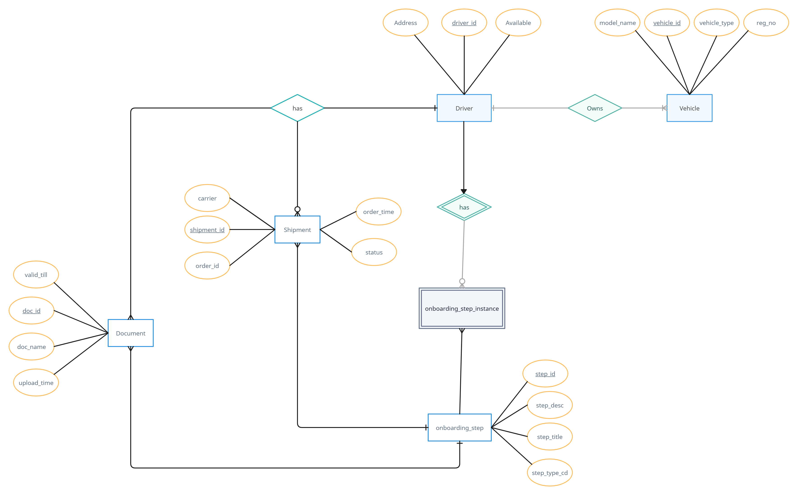
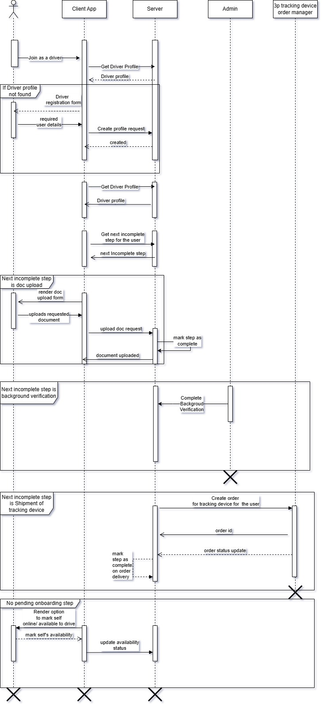
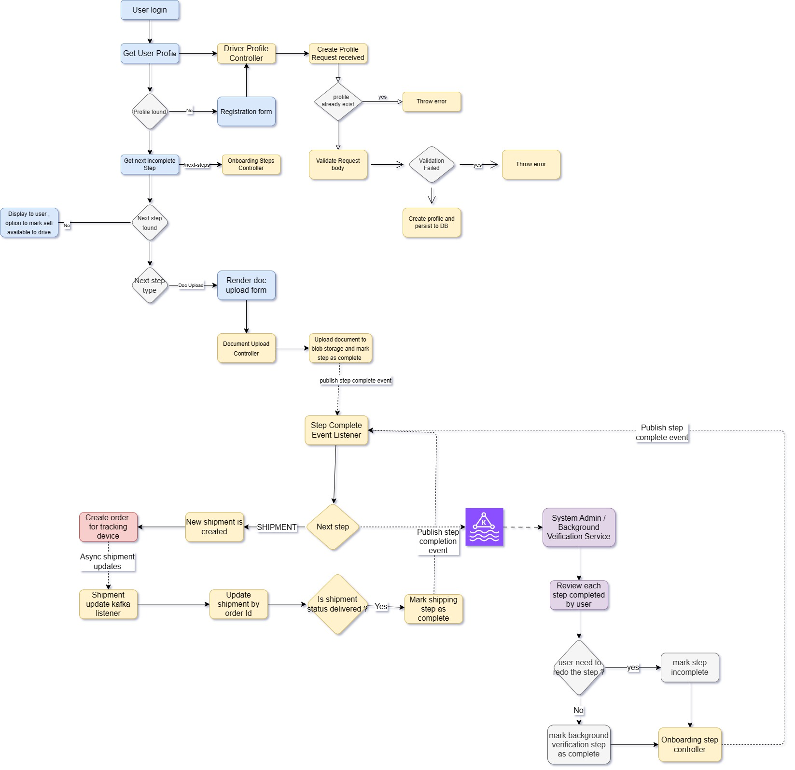

# Driver Onboarding Module

### Features :

- Sign Up as a driver
- Onboarding driver through various steps:
  - document collection
  - background verification
  - shipment of tracking device
- Allow driver to mark itself available to drive

### Workflow :

- User logs in to the client app, and click on the option, **Join as a driver**.
- on click, client calls the service, if the user's driver profile is created, service replies with profile snapshot, else server replies with No content HTTP status.
- if driver profile is not found, user is greeted with form to enter basic info details for driver profile.
- once user submits the details, user's driver profile is created.
- Once user profile is created, client call backend to get a list of onboarding steps user has to complete.
- For our use case, onboarding steps are : 
  - Document Upload
  - Background Verification (includes document verification)
  - Shipment of tracking device
- Client prompts user to complete each incomplete step, e.g. for document upload step, user has to upload a document as requested.
- Once all document upload steps are complete, a background verification step is displayed, which is completed from backend by 
system admin manually/ or AI systems.
- Once system admin mark a user profile as verified, an order creation request is triggered to a third party service for delivery of a vehicle tracking device to the user.
- All the shipment status updates are sent by the 3rd party service to our service using kafka.
- once shipment is delivered to the driver, we mark the last (shipment) step as complete.
- once all onboarding steps are completed, an option is enabled on the client side for the user to mark itself as available to drive.

### ER diagram

### Sequence diagram

### Flow chart diagram
